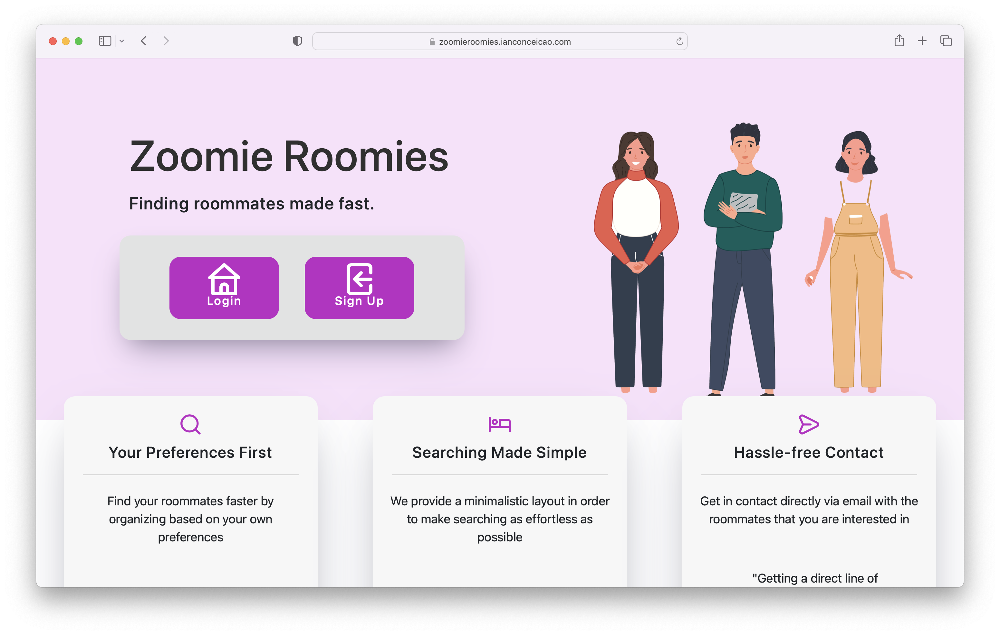
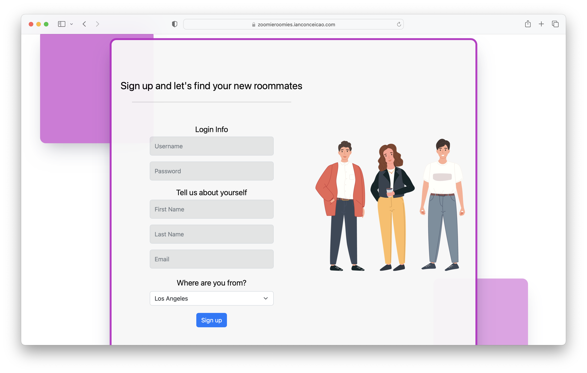
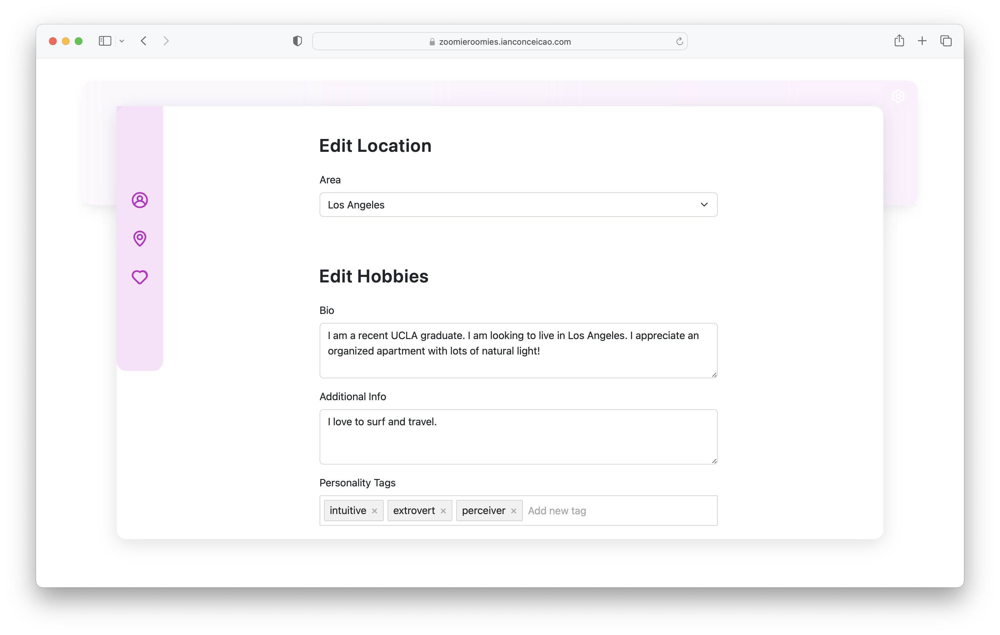

# Zoomie Roomies

Tour the website at:
<a href="https://zoomieroomies.ianconceicao.com/">
zoomieroomies.ianconceicao.com
</a> 

## Motivation

Graduating university leads to a lot of change, and it can often be difficult to start the next phase of your life. Zoomie Roomies is a website I and some friends made to help new-grads find roommates. Users can sign up, login, submit information about themselves, and search for roommates or browse through recommended potential roommates.

I specifically worked on the backend, database structure, object models and roommate recommendation algorithm.

 

## Tech Stack

- **Fronted:** React.js
- **Backend:** Node.js + Express.js
  - Uses [TypeScript enterprise standards](https://medium.com/slalom-build/typescript-node-js-enterprise-patterns-630df2c06c35) for the architecture
- **Database:** MongoDB hosted with MongoDB Atlas
- **Continuous Deployment:** Netlify for the frontend, Heroku for the backend

 

## Authors

<table border="0px">
 <tr>
 <td><a href="https://github.com/archang19">Andrew Chang</a></td>
 <td><a href="https://github.com/IanConceicao">Ian Conceicao</a></td>
 <td><a href="https://github.com/PatriciaXiao">Patricia Xiao</a></td>
 </tr>
 <tr>
 <td><a href="https://github.com/jsethlui">Jeremy Louie</a></td>
 <td><a href="https://github.com/Ssirrikh">
Ssirrikh</a></td>
<td><a href="https://github.com/SZnCu99">Xintong Liu</a></td>
    
 </tr>
 </table>
 

 

